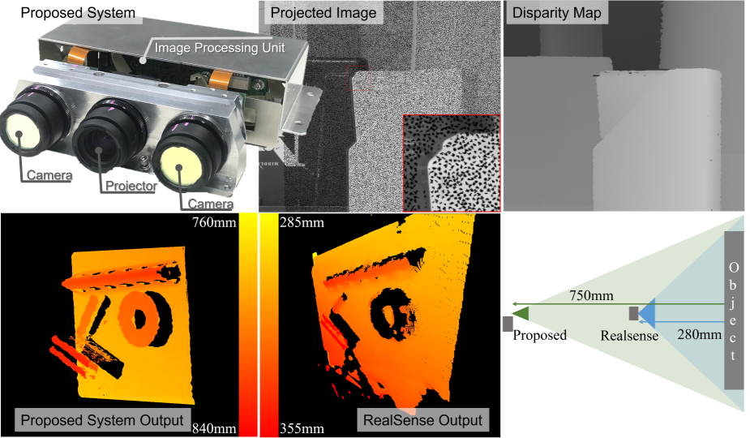
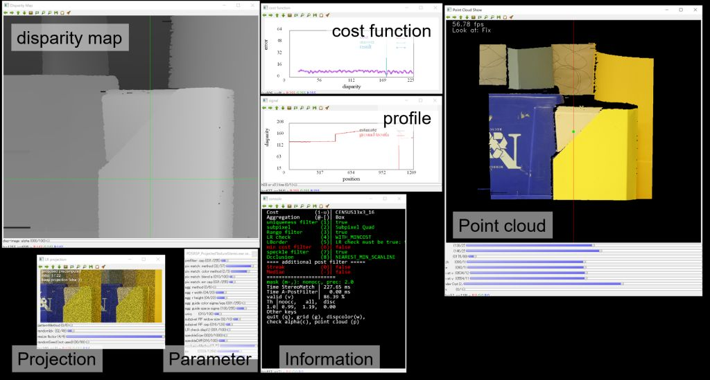

# Poisson Disk Sampling with Randomized Satellite Points for Projected Texture Stereo
Project page of the paper "Poisson Disk Sampling with Randomized Satellite Points for Projected Texture Stereo".





# Paper
J. Takeda and N. Fukushima, "Poisson Disk Sampling with Randomized Satellite Points for Projected Texture Stereo," Optics Continuum, 2022.

* [pdf]()
* [code](https://github.com/norishigefukushima/PDSRSP_ProjectedTextureStereo) 

# Citation
J. Takeda and N. Fukushima, "Poisson Disk Sampling with Randomized Satellite Points for Projected Texture Stereo," Optics Continuum, vol.1, no.4, 2022.

BibTeX
```bibtex
@article{takeda2022poisson,
author = {Jun Takeda and Norishige Fukushima},
title = {Poisson Disk Sampling with Randomized Satellite Points for Projected Texture Stereo},
journal = {Opt. Continuum},
publisher = {OSA},
number = {4},
volume = {1},
pages = {834--845},
month = {Apr},
year = {2022},
url = {},
doi = {},
}
```
# Compile
The codes are written in C++.
The library is only tested in Windows with Visual Studio.

The dependency is OpenCV and our library of [OpenCP](https://github.com/norishigefukushima/OpenCP).
For compiling the OpenCP library, Qt maybe required.
Pre-compiled OpenCP libraries are attached in OpenCP dir.

The project use the following system environment variable as Macro; please set your environment variables according to your environment or write the path directly in the sln project file.
The examples are as follows;
```
OPENCV_INCLUDE_DIR = "C:\OpenCV\include"
OPENCP_INCLUDE_DIR = "C:\OpenCP\include"
OPENCV_LIB_DIR = "C:\OpenCV\lib"
OPENCP_LIB_DIR = "C:\OpenCP\lib"
```
Also, OpenCP.dll must be located in the active pass.
For example,
```
PATH = "C:\OpenCP\bin"
```

# Usage

In `main.cpp`, we can switch the following functions. The main simulation code is `stereoTest`.
```cpp
stereoTest();//test for stereo matching
pointcloudTest();//test for point cloud rendering for Fig. 12
//generatePDSMask(Size(1400, 1120), 2.f, 10);// function to prepare PDS masks for stereo test.
```

For `stereoTest,` we can change the following conditions;

* images (27 images from Middlebury dataset 2005 and 2006)
* projection pattern and density (proposed, random, Poisson disk sampling (PDS), no projection)
* matching method (SAD, SSD, census, etc.)

The processing flow is as follows;
1. load stereo images and disparity maps,
2. compute min/max search range
3. generate the center disparity map for projection
4. add noise (optional)
5. call the method of `gui` in `class StereoMatch,` which is the main stereo matching function.

The overview of the function call is shown in the following figure.
We have 7 windows; disparity map, projection, parameters, cost function, profile, console information, and point cloud (optional).


Each window and keyboard shortcut can change the parameters.

* In the disparity map window, we can change the RGB alpha blending ratio between an RGB image and a disparity map by "disp-image" trackbar.
Also, mouse-clicking over the window changes the position of the cost function and profile plots.
* In the profile window, the trackbar "H(0) or V(1) line" switches the horizontal or vertical signal profile plot.
* In the projection window, we can change the projection pattern and density.
    * "patternMethod trackbar" changes the projection methods:

        0. proposed (precomputed)
        1. random (precomputed)
        2. PDS (precomputed)
        3. no mask
        5. proposed (on the fly)
        6. random (on the fly)
        7. PDS (on the fly)
    * "randomIdx trackbar" changes the density of the on the fly projection (5-7).
    * "resize factor trackbar" change the size of this window.
    * if we press `r` key, you can toggle the update of the random seed or not.
    * "randomSeed(not used) trackbar" is not work in the default setting; please prepare the other random mask by using the `generatePDSMask` function.
* Parameters for stereo matching can be changed in the keyboard shortcuts listed in the information window or the trackbars in the parameter window.
    * "prefilter cap" is for truncating the Sobel filtering response for Sobel SAD/SSD matching
    * "pix match: method" or keyboard shortcut(i-u) can change the cost functions: SAD, SSD, edge-SAD, census, etc.
    * "pix match: blend a" only work for xxxBlend cost function, which blends image-based cost (e.g.m SAD) and edge-based cost (e.g., Sobel-SAD)
    * "pix match: err cap" truncate the pixel matching cost excepting census transformation.
    * "agg method" or keyboard shortcut(@-[) can change the aggregation method for cost function; however, box aggregation is the almost best in the projection case.
    * agg r width/height can change the horizontal or vertical size of the aggregation window.
    * "agg guide color sigma/eps"/"agg guide space sigma" control the parameter for edge-preserving aggregation; however, compared to the no-projection case, edge-preserving aggregation does not work effectively because the projection pattern disturbs the matching.
    * "uniq" controls the uniqueness filter, which invalidates the nonunique matching in the cost function. key (1) toggle able/disable the filter.
    * "subpixel RF window size" control the window size of the post-filtering for disparity map, bilateral filter-like filter, which has binary weight in range kernel, and flat weight for spatial kernel.
    * "subpixel RF cap" is the threshold value for the post-filtering
    * key shortcut (2) changes the subpixel estimation methods and (3) disables the post-filter.
    * "LR check disp12" is the parameter for single image LR-check for invalidating the disparity map. 
    * key shortcut (4) change the LR-check method
    * key shortcut(5) replicate left boundary to stabilize the most left occluding areas.
    * "speckleSize/Diff" change the post-filter of speckle filtering used in OpenCV and key (7) toggle the able/disable the filter
    * key(8) or occlusion method toggles filling occlusion areas or not.
    * px and py is the focusing pixel.
    * (0)  or (-) keys are the additional post filters 
* For the point cloud window, press `p` key for calling the window. If we press `q` key after calling, the window is closed.

# Patent
The matching method of the skipped census transform and the projection method of Poisson disk sampling with randomized satellite points are patent pending.

# Note

# Link
* [Middlebury dataset 2005](https://vision.middlebury.edu/stereo/data/scenes2005/)
* [Middlebury dataset 2006](https://vision.middlebury.edu/stereo/data/scenes2006/)
* [OpenCP](https://github.com/norishigefukushima/OpenCP)

